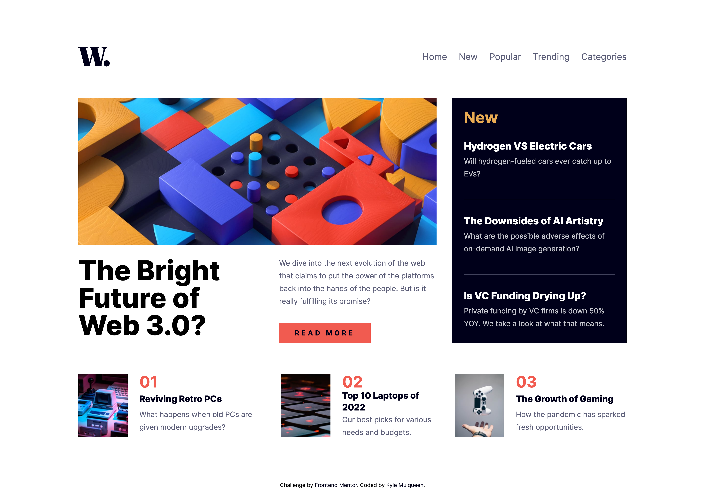
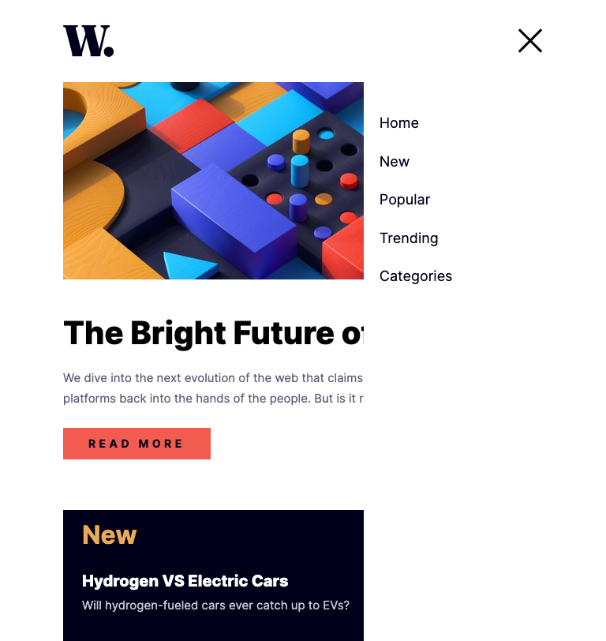

# Frontend Mentor - News homepage solution

This is a solution to the [News homepage challenge on Frontend Mentor](https://www.frontendmentor.io/challenges/news-homepage-H6SWTa1MFl). Frontend Mentor challenges help you improve your coding skills by building realistic projects.

## Table of contents

- [Frontend Mentor - News homepage solution](#frontend-mentor---news-homepage-solution)
  - [Table of contents](#table-of-contents)
  - [Overview](#overview)
    - [The challenge](#the-challenge)
    - [Screenshot](#screenshot)
    - [Links](#links)
  - [My process](#my-process)
    - [Built with](#built-with)
    - [What I learned](#what-i-learned)
    - [Continued development](#continued-development)
    - [Useful resources](#useful-resources)
  - [Author](#author)

## Overview

### The challenge

Users should be able to:

- View the optimal layout for the interface depending on their device's screen size
- See hover and focus states for all interactive elements on the page

### Screenshot

**Desktop**

**Tablet**

**Mobile**

### Links

- Live Site URL: [GitHub Pages](https://kmulqueen.github.io/news-homepage/)

## My process

### Built with

- Semantic HTML5 markup
- CSS custom properties
- Tailwind CSS
- Flexbox
- CSS Grid
- Mobile-first workflow
- JavaScript

### What I learned

This project really deepened my understanding of CSS Grid, especially using `grid-template-areas` to create clean layouts where images and text actually line up properly. I got comfortable with `object-fit: cover` for handling images of different sizes without them looking stretched or weird. Building the mobile navigation was probably the biggest learning curve - getting `position: fixed` to work right for the menu overlay and then figuring out how to make it keyboard accessible took some trial and error. The biggest takeaway was learning to debug CSS more methodically instead of just changing random properties and hoping something works.

### Continued development

To clean up the desktop layout issues and ensure pixel-perfect alignment with the design. I'd also like to implement proper navigation functionality - currently the nav items are static, but it would be cool to make them actually route to different pages. Perhaps that would be easier using a framework like React or exploring client-side routing.

I'd also like to dive deeper into CSS Grid subgrid when it gains broader browser support, as it could simplify some of the alignment challenges I faced.

AUTHOR : https://www.frontendmentor.io/profile/Abayneetsingh
